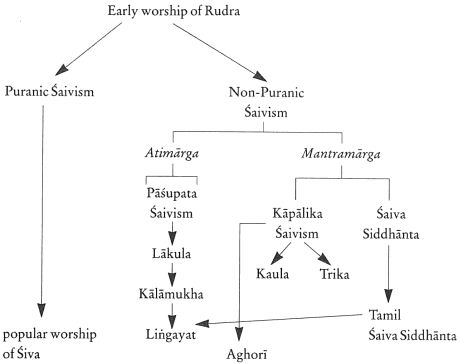
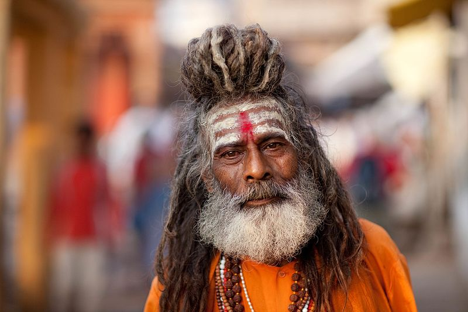
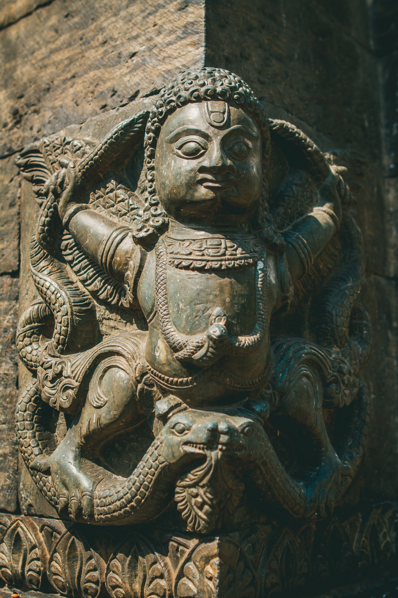

It's very easy to make some **website** with various types of *technologies*. You can visit my first [first repo](https://github.com/AniketTheGreat/AniketTheGreat.github.io) here.
Let's tell you something about me :
 * I am ardent follower of Shiva
 * 12 year old as of now

###### There are two main sects of follower in hinduism
#### Shaivism and VAishnavism

Shiva is formerly known as **Rudra** and history can be stated by the image

 

Followers wore a tika on forehead as

 

The Auspicious animal assosiated with shiva is

Numerous number of temples are present all over the country and thousands of people go to worship shiva daily.

Beautiful Sculptures are made at temples .

Bells in indian temples are present at entry and exit point .

Shiva also termed as **Natraja** King of dancing . He holds  **Trishul** and **Damru** in his hands.

